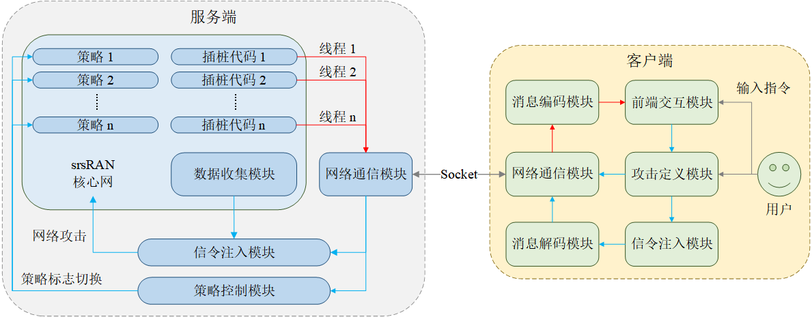
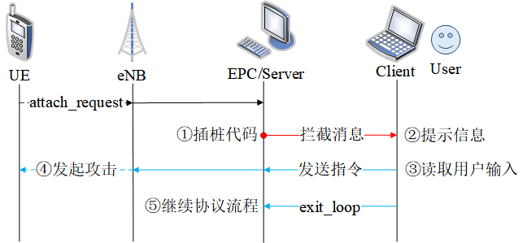
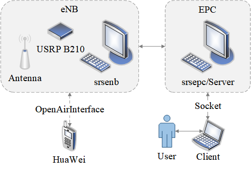

# LSCAP
> Long-Term Evolution（LTE）网络由于其全 IP 化的异构网络结构，其用户仍然面临着遭受恶意攻击的威胁。在 LTE 的安全研究中，开源 Software-Definition Radio（SDR）常被用于攻击验证，但是由于 LTE 协议以及 SDR 代码的复杂性，理解并修改其代码将会耗费大量的时间，并且要求研究者具有较高的编程水平。因此，为了提高研究的效率，我们团队设计并开发了一款基于 OAI 的 LTE 攻击验证平台。然而，由于 OAI 本身的局限性，并且该平台的架构在设计上存在着缺陷。因此，我们对其进行了改进，并重新设计了一款基于 srsRAN 的 LTE 网络安全研究平台。

LSCAP（LTE Signaling Control and Analyse Platform）是一款基于 srsRAN 的 LTE 网络安全研究平台。LSCAP 在 LEAP 的基础上优化了平台的设计并提供了更加强大的功能，包括：

- LSCAP 基于 srsRAN 进行开发，srsRAN 使用具有面向对象特性的 C++ 语言进行编写，在设计时特别关注了代码的模块化和代码间的复用，遵循了高内聚低耦合的设计原则，其代码更加清晰易读。
- LSCAP 优化了平台的代码结构，它隔离了不同研究之间的代码并使它们充分解耦，这使我们可以轻易地对更多的研究内容进行扩展，而不用担心新增的代码会影响已有的研究。
- LSCAP 对客户端的代码进行了封装并提供了对外交互的接口，使平台可以动态地读取用户的输入并执行不同的操作，更加灵活易用。
- LSCAP 增加了对安全数据进行收集和分析的功能，在 srsRAN 中，这些安全数据可以用于信令的组装和发送，也可以根据需求提供给用户进行分析和研究。

## 系统架构

本平台基于 srsRAN 进行搭建，由服务端和客户端两部分组成，其架构如下图所示：

平台的服务端使用 C++ 语言进行编写，包含以下模块：

- 代码插桩模块：能够拦截 srsRAN 中的消息并创建线程与客户端进行通信。
- 网络通信模块：能够完成数据的收发。
- 数据收集模块：能够收集 srsRAN 中的安全数据。
- 信令注入模块：能够根据用户指令向网络中注入伪造的非法信令。
- 策略控制模块：能够根据用户指令控制网络的消息处理策略。

平台的客户端使用 Python 语言进行编写，包含以下模块：

- 网络通信模块：能够完成数据的收发。
- 消息编解码模块：能够对消息进行编解码处理。
- 前端交互模块：能够实时地读取并处理用户的输入。
- 攻击定义模块：能够让用户灵活地定义攻击的流程。
- 信令注入模块：能够根据攻击的定义命令服务端向网络注入伪造的非法信令。

## 工作流程

下面将以 UE 的 attach 流程为例，介绍本平台的工作流程，如下图所示：

1. 服务端的插桩代码成功拦截到来自 UE 的 `attach_request` 消息，然后创建线程循环接收客户端的指令，并将当前拦截到的消息类型和插桩信息等内容组装为消息发送给客户端，同时阻塞接下来的协议流程。
2. 客户端接收并解析来自服务端的消息，然后向用户给出关于 srsRAN 当前插桩位置的提示，等待并读取用户的输入。
3. 客户端根据用户输入执行对应的攻击流程，向服务端组装并发送对应的指令。
4. 服务端根据客户端指令对网络发起对应的攻击。
5. 用户向服务端发送 `exit_loop` 指令，通知服务端结束当前插位置的循环接收，并继续协议原流程。

## 平台特点

### 可扩展性

LSCAP 为 srsRAN 提供了更加丰富的执行策略，并使用服务端进行控制。该设计可以将 srsRAN 中不同研究之间的代码进行隔离，并封装为不同的策略，从而使我们能够轻易地对更多的研究内容进行扩展。具体地，不同的策略之间使用一个 `flag` 变量进行区分，当服务端收到来自客户端的指令时，会根据用户指令为对应的 `flag` 进行设置，然后 srsRAN 的函数就会根据 `flag` 自动切换不同的处理策略。比如，当 LEAP 在验证鉴权同步失败攻击时，为了更好地观察攻击的结果，就修改了 HSS 中关于 SQN 的算法，加速了攻击生效的过程，然而当我们想验证其它攻击时，还需要恢复 HSS 中的代码，并对 OAI 的代码重新进行编译和运行，该过程会耗费大量的时间。当使用 LSCAP 来验证该攻击时，我们可以将 HSS 中不同的算法封装为不同的策略，并根据用户指令进行切换，这样就可以减少用户大量的重复工作，并且可以根据需要增加更多的策略，具有很好的可扩展性。

### 灵活性

LSCAP 将客户端中不同攻击的定义封装为了不同的指令，每一个指令都对应一个用户定义的攻击流程，并且还提供了与用户进行交互的接口。该设计使用户可以根据当前网络的执行情况，实时地向服务端发送指令，用户只需要输入当前希望执行的指令，然后客户端就会读取该输入并执行不同的攻击。然而，LEAP 在验证不同的攻击时，需要独立编写对应的 Python 脚本，当我们验证的攻击种类很多时，会造成脚本数量的剧增，并且 LEAP 的脚本在实验开始前就已经提前编写好，实验开始后就无法再进行修改，灵活性差。而 LSCAP 只需要在一个脚本中根据用户输入调用不同的逻辑，具有很好的灵活性。

### 并发性

LSCAP 采用了多线程技术，可以更好地支持对并发类型的攻击进行验证。当 srsRAN 执行到插桩代码处时，LSCAP 会使用 `pthread_create()` 函数创建一个新线程与客户端进行通信，因此我们可以同时在网络的多个位置处注入信令，这使用户能够对攻击模式更加复杂的攻击进行验证。然而，LEAP 使用当前插桩位置处的线程与客户端进行通信，因此同时只能在一处插桩位置注入信令，具有一定的局限性。另外，LSCAP 还可以选择使用 `pthread_join()` 函数阻塞当前的协议流程，该设计可以保证服务端成功接收并执行完用户指令后，协议栈才继续向下执行，避免了用户指令还未生效而协议栈就提前进入了下一个流程从而使攻击验证失败的情况。比如，当 LEAP 在验证麻木攻击时，并没有阻塞后续的鉴权流程，协议原本的 `authentication_request` 可能先于 `authentication_reject` 被发送，从而使攻击验证失败。因此，LSCAP 对网络中的信令具有比 LEAP 更加强大的控制能力。

### 数据收集

LSCAP 在 LEAP 的基础上增加了对安全数据进行收集的能力，可以在 srsRAN 运行的过程中收集网络中的安全数据。比如，LSCAP 会动态地收集并更新 UE 的上下文、基站的 socket 信息、EPC 的接口信息等数据，这些数据可以被服务端用于组装和发送伪造的信令。另外，这些数据也可以根据用户需求被提取出来，提供给有需要的团队进行相关的研究和分析。

## 平台部署

为了验证本平台的功能，我们使用了两台操作系统为 Ubuntu 16.04.7 的计算机分别运行 srsenb 和 srsepc，并搭配 USRP B210 等硬件设备搭建了一个简易的 LTE 移动通信网络。为了更好地研究不同攻击的效果，我们使用了真实的商用手机华为作为终端设备。

本平台的部署环境如下图所示：

