# LTE 学习笔记

该笔记为本人在读研期间学习 LTE 的过程中不断积累和总结的产物，涉及的内容如下：

- 网络架构
- 协议栈
- 信令流程
- 安全机制
- UE 上下文
- 代码参考

> 该笔记为本人通过查阅书籍和论文，分析具体代码，并在不断的实验中总结而成，如有错误请多包含。 

# 1  网络架构

LTE 网络的规范名称是 EPS（Evolved Packed System，演进的分组核心网），由 E-UTRAN（Evolved UMTS Terrestrial Radio Access Network，演进的 UMTS 陆地无线接入网）和 EPC（Evolved Packet Core，演进的分组核心网）组成。

LTE 网络的架构如下图所示：

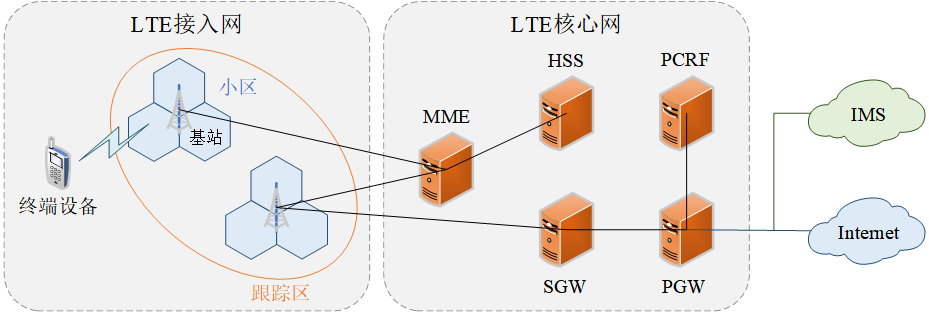

## 1.1  无线网

E-UTRAN 即 LTE 无线网络，其作用是连接终端和核心网，主要负责实现移动通信业务的覆盖并对无线资源进行管理和控制。在 LTE 无线网络中只有一种网元：eNB（基站），eNB 之间通过 X2 接口互联。eNB 与 MME 之间通过 S1-MME 接口进行连接，与 SGW 之间通过 S1-U 接口进行连接。

E-UTRAN 的主要功能如下：

- 小区间无线资源的管理
- 无线承载的管理
- 连接状态移动性管理（切换）
- 无线准入控制
- eNB测量报告的配置与规定
- 动态资源调度

## 1.2  核心网

### 1.2.1  MME

MME（Mobility Management Entity，移动性管理实体）是 LTE 系统的控制面，主要用于对移动用户进行管理，负责对处于空闲状态的 UE 进行定位和寻呼、对非接入层（NAS）的信令进行加密和完整性保护以及对用户的业务信令进行处理。MME 可以与 eNB（基站）、HSS 和 SGW 等设备进行交互，与 HSS 之间通过 S6a 接口进行连接，与 SGW 之间通过 S11 接口进行连接，与 eNB（基站）之间通过 S1-MME 接口进行连接，这些接口都基于 IP 协议。

MME 的主要功能如下：

- 用户鉴权：通过 UE 和 EPC 之间的双向鉴权，从而完成终端和网络之间的身份鉴别，从而达到防御恶意攻击并保护移动通信网络资源的目的。该功能需要与 HSS 进行交互。
- 移动性管理：主要包括寻呼和切换。
- 漫游控制：当漫游用户接入系统后，MME 需要访问漫游用户所属的 HSS，从而得到该用户的信息。
- 网关选择：一个 MME 可以连接到多个 SGW，由 MME 负责指派处理用户业务的 SGW。
- 承载管理：Bearer（承载）即用户的业务数据流，承载管理涉及承载的建立和释放等。
- TA列表管理：TA（Tracking Area，跟踪区）由一些 eNB 所覆盖的小区组成。每个 eNB 都属于一个 TA，每个 UE 也有其对应的归属 TA，这些 TA 构成了 UE 的 TA 列表，当终端从一个 TA 进入到一个新的 TA（不在 UE 的 TA 列表中）时，需要进行 TA 更新。

### 1.2.2  SGW

SGW（Serving GateWay，服务网关）是 LTE 系统的业务面，主要负责 eNB 之间的切换、执行合法的监听、处理用户业务并对数据包进行路由和转发以及完成移动数据业务的承载。SGW 主要与 eNB、MME 以及 PGW 等设备进行交互，与 eNB 之间通过 S1-U 接口进行连接，与 MME 之间通过 S11 接口进行连接，与 PGW 之间通过 S5/S8 接口进行连接。

SGW 的主要功能如下：

- 在与 GSM/WCDMA 系统进行切换时，充当 LTE 核心网的锚点。
- 作为 LTE 系统内部移动性的锚点
- 在空闲状态下缓存下行数据
- 进行用户数据包的路由和转发
- 计费和监听

### 1.2.3  PGW

PGW（PDN GateWay，PDN 网关）主要负责管理与 PDN（分组数据网，即 Internet）的接口。PGW 可以与 SGW 和 PCRF 等设备进行交互，与 SGW 之间通过 S5/S8 接口进行连接，与 PCRF 之间通过 Gx 接口进行连接，与 PDN 之间通过 SGi 接口进行连接。

PGW 的主要功能如下：

- 作为互联网的接入点
- 为用户分配 IP 地址
- 进行数据包的路由和转发
- 计费
- 策略控制执行功能
- 合法监听

### 1.2.4  HSS

HSS（Home Subscribers Server，归属用户服务器）是 EPC 中的数据库，主要负责存储网络用户的用户信息。

### 1.2.5  PCRF

PCRF（Policy and Charging Rules Function，策略与计费规则功能）主要负责控制网络的服务质量（QoS）。

# 2  协议栈

LTE 网络的协议栈如下图所示：

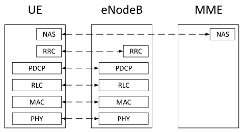

其中，基站只负责接收并转发来自 UE 和 MME 的信令和数据，它并不包含 NAS 层的功能。

OSI 参考模型采用了一些术语来描述分层服务的过程：

- SAP（Service Access Point，服务接入点）：是层与层之间的接口，上一层的实体通过 SAP 得到下一层实体的服务。SAP 是一对一的，但每个实体可以提供多个 SAP，因此可以为多个上一层的实体服务。
- SDU（Service Data Unit，服务数据单元）：SAP 上传递的是 SDU，当前层收到上一层的 SDU 后，加上本层的头封装为 PDU（Protocol Data Unit，协议数据单元）后，传到下一层。
- 数据头：接收方处理 PDU 所需要的控制信息。SDU 出现在接口上，而 PDU 出现在处理实体中。

> - RRC：Radio Resource Control（无线资源控制）。
> - AS：Access Stratum（接入层），包括物理层、链路层、网络层（L1 - L3）。
> - NAS：Non Access Stratum（非接入层），即 upper（上层）。

## 2.1  空中接口

LTE 空中接口又叫 Uu 接口，是终端与基站之间的无线接口，利用空中的无线电波来传递信息。空中接口是终端与 LTE 移动网络之间通信的唯一接口，终端只有通过空中接口连接到无线网络后，用户才能获得移动通信系统提供的服务。由于 LTE 空中接口需要提供相当多的功能，而且还要在众多厂家、众多品牌的终端与基站之间传送信息，因此采用了基于 OSI（Open System Interconnection，开放式系统互联通信）参考模型的开放式协议栈。空中接口协议栈的最上层是应用层，往下依次是网络层、链路层和物理层。其中，应用层属于 NAS（Non Access Stratum，非接入层），网络层、链路层和物理层属于 AS（Access Stratum，接入层）。

LTE 空中接口的协议栈如下图所示：

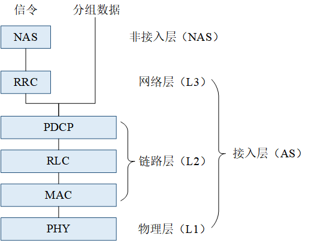

LTE 空中接口上传送的信息包括信令和分组数据。LTE 空中接口上传输的信令包括 NAS 信令和 RRC 信令。NAS 信令在 UE 和 MME 之间进行传递，RRC 信令在 UE 和基站之间进行传递。基站没有非接入层，不负责处理信息，只负责为 MME 和 UE 转发 NAS 信令。

### 2.1.1  RRC 子层

RRC（Radio Resource Control，无线资源控制）子层是网络层的最低子层，只处理信令而不处理业务数据，主要负责 LTE 空中接口的无线资源分配与控制。另外，RRC 层还参与了待机状态和联机状态的众多处理机制，比如广播、寻呼、鉴权、加密、业务连接的建立与释放、测量配置与测量报告等。RRC 子层通过 RRC 连接传送终端与基站之间的信令，即 RRC 信令。LTE 空中接口上传送的网络层信令大部分都是 RRC 信令。RRC 连接即终端与基站之间的信令连接，实现中断与基站两者之间 RRC 实体的互连。在 RRC 连接的基础上，终端通过基站进一步与 MME 建立信令连接，借助 RRC 连接和 S1 信令连接来传递与 MME 相关的 NAS 信令。当终端处于待机状态时，终端与基站之间没有 RRC 连接，只有进入联机状态后，终端与基站之间才会建立 RRC 连接。

### 2.1.2  PDCP 子层

PDCP（Packet Data Convergence Protocol，分组数据汇聚协议）子层位于 RRC 层和 RLC 层之间，不仅需要处理分组业务数据，还需要处理控制面的信令，主要用于对 IP 数据包的包头进行压缩。由于所有的 IP 数据包都存在一个大小为 20 字节的包头，需要占用大量的无线资源，为了提高 IP 数据包在空中接口上的传输效率，需要对 IP 数据包的头部信息进行压缩。因此，PDCP 子层在控制面上主要负责加密和完整性保护，在用户面上主要负责加密、包头压缩以及切换支持。

### 2.1.3  RLC 子层

RLC（Radio Link Control，无线链路控制）子层位于 PDCP 子层和 MAC 子层之间，主要负责为上层应用提供可靠的数据传输业务，是 LTE 空中接口上保证服务质量（QoS）的重点。RLC 子层主要通过分段机制、ARQ（Automatic Repeat Request，自动重传请求）机制以及重组机制来保证点到点的数据可靠。

### 2.1.4  MAC 子层

MAC（Medium Access Control，介质访问控制）子层位于 RLC 子层和 PHY 子层之间，主要用于实现逻辑信道的复用。MAC 子层可以将 DCCH、DTCH 和 BCCH 等复用到 SCH 上，并且还支持 HARQ 机制、随机接入机制、时间提前机制以及调度机制。

### 2.1.5  PHY 子层

PHY（Physical，物理）层是 LTE 空中接口协议栈的最底层，涉及 OFDM 和多天线等 LTE 关键技术，并且实现了测量和功率控制等机制。

## 2.2  S1 接口

S1-MME：

- 是网络的控制面，用来连接 MME 与 eNB，用于传送信令。
- 底层是 IP 网络。
- 使用 SCTP 协议作为传输层协议。
- 使用 S1-AP 协议作为应用层协议。

S1-U：

- 是网络的用户面，用来连接 SGW 与 eNB，用于传送业务数据。
- 底层是 IP 网络。
- 使用 UDP 协议作为传输层协议，以减少传输的时延。
- 使用 GTP-U 协议作为应用层协议，用于承载用户面的数据包。

> MME 的接口：
>
> - MME <-> eNB：S1-MME 接口（使用 S1AP 协议）
> - MME <-> SPGW：S11 接口（使用 GTP-C 协议）
> - MME <-> HSS：S6a 接口
> - ……

### 2.2.1  SCTP 协议

SCTP（Stream Control Transmission Protocol，流控传输协议）是一种在网络连接两端之间同时传输多个数据流的协议。它在 TCP/IP 协议栈中所处的位置和 TCP、UDP 类似，兼有 TCP/UDP 两者特征。SCTP 是可以确保数据传输的，和 TCP 类似，也是通过确认机制来实现的。

关联：SCTP 在客户和服务器之间提供关联（association），并像 TCP 那样给应用提供可靠性、排序、流量控制以及全双工的数据传输。

> SCTP 中使用“关联”一词替代“连接”是为了避免这样的内涵：
>
> - 一个连接只涉及两个 IP 地址间的通信。
> - 一个关联指代两个系统之间的一次通信，它可能因为 SCTP 支持多宿而涉及不止两个地址。

多宿：SCTP 提供多宿特性，使得单个 SCTP 端点能够支持多个 IP 地址。该特性可以增强应对网络故障的健壮性。一个端点可能有多个冗余的连接，每个网络又可能有各自接入因特网基础设施的连接。当该端点与另一个端点建立一个关联之后，如果它的某个网络或某个跨域因特网的通路发生故障，SCTP 就可以通过切换到使用已与该关联的另一个地址来避免发生的故障。

报文格式：一个 SCTP 分组含了一个公共的分组头（Common Header）和若干数据块（Chunk）。每个数据块中既可以包含控制信息，也可以包含用户数据。

SCTP vs TCP：

- 相同点：
  - 和 TCP 类似，SCTP 是面向连接、端到端、全双工、带有流量和拥塞控制的可靠传输协议。
- 不同点：
  - SCTP 的连接称为关联。SCTP 的关联通过 4 次握手建立，相对于 TCP 的 3 次握手建立连接，SCTP 的关联能够抵御拒绝服务（DoS）攻击，从而提高了安全性。数据只有在关联建立之后与关联关闭之前才可发送。SCTP 的关联通过 3 次握手关闭，不支持类似 TCP 的半关闭连接。也就是在任何一方关闭关联后，对方即不再发送数据。
  - SCTP 是面向消息（message-oriented）的。它提供各个记录的按序递送服务，与 UDP 一样，由发送端写入的每一条记录的长度随数据一道传递给接收端应用。
  - SCTP 能给在所连接的端点之间提供多个流，每个流各自可靠地按序递送消息。一个流上某个消息的丢失不会阻塞同一关联其他流上消息的投递。这种做法与 TCP 正好相反，就 TCP 而言，在单一字节流中任何位置的字节丢失都将在阻塞该连接上其后所有数据的递送，直到该丢失被修复为止。

四次握手：

1. 客户端发送一个 INIT（初始化）消息。该消息告诉服务器客户的 IP 地址清单、初始序列号、用于标识本关联中所有分组的起始标记、客户请求的外出流的数目以及客户能够支持的外来流的数目。
2. 服务器以一个 INIT ACK 消息确认客户的 INIT 消息。该消息中含有服务器的 IP 地址清单、初始序列号、起始标记、服务器请求的外出流的数目、服务器能够支持的外来流的数目以及一个状态 cookie。状态 cookie 包含服务器用于确信本关联有效所需的所有状态，它是数字化签名过的，以确保其有效性。
3. 客户端以一个 COOKIE ECHO 消息回射服务器的状态 cookie。除 COOKIE ECHO 外，该消息可能在同一个分组中还捆绑了用户数据。
4. 服务器以一个 COOKIE ACK 消息确认客户回射的 cookie 是正确的。本关联建立完毕，该消息也可能在同一个分组中还捆绑了用户数据。

三次挥手：SCTP 不像 TCP 那样允许“半关闭”的关联。当一端关闭某个关联时， 另一端必须停止发送新的数据。关联关闭请求的接收端发送完已经排队的数据（如果有的话）后，完成关联的关闭。

> SCTP 没有类似于 TCP 的 TIME_ WAIT 状态，因为 SCTP 使用了验证标记。所有后续块都在捆绑它们的 SCTP 分组的公共首部标记了初始的 INIT 块和 INIT ACK 块中作为起始标记交换的验证标记。由来自旧连接的块通过所在 SCTP 分组的公共首部间接携带的验证标记对于新连接来说是不正确的。因此，SCTP 通过放置验证标记值就避免了 TCP 在 TIME_WAIT 状态保持整个连接的做法。

### 2.2.2  GTP 协议

是一种 IP 包的封装协议，即 IP over IP。所谓用户面 PDU，就是 IP 数据包，这些 IP 数据包经过 GTP 协议的封装，可以在 LTE 核心网中传送。

> 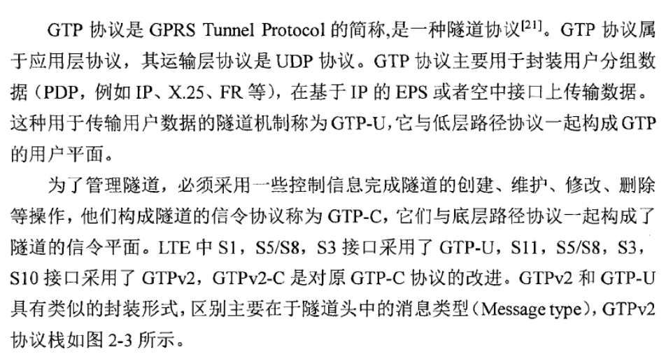

# 3  信令流程

信令流程是指通信系统不同设备之间信令的交互过程，发生在设备之间的接口上，这些在接口上传递的信息需要遵循一定的协议。由于信令流程发生在接口上，并且 LTE 系统的空中接口是开放的，因此信令流程可以从外部进行观察并为我们提供许多有价值的信息。我们可以通过分析信令流程来判断设备的运作是否正常，从而定位故障并解决问题。

## 3.1  附着流程

在 LTE 网络中，UE 的附着流程如下图所示：

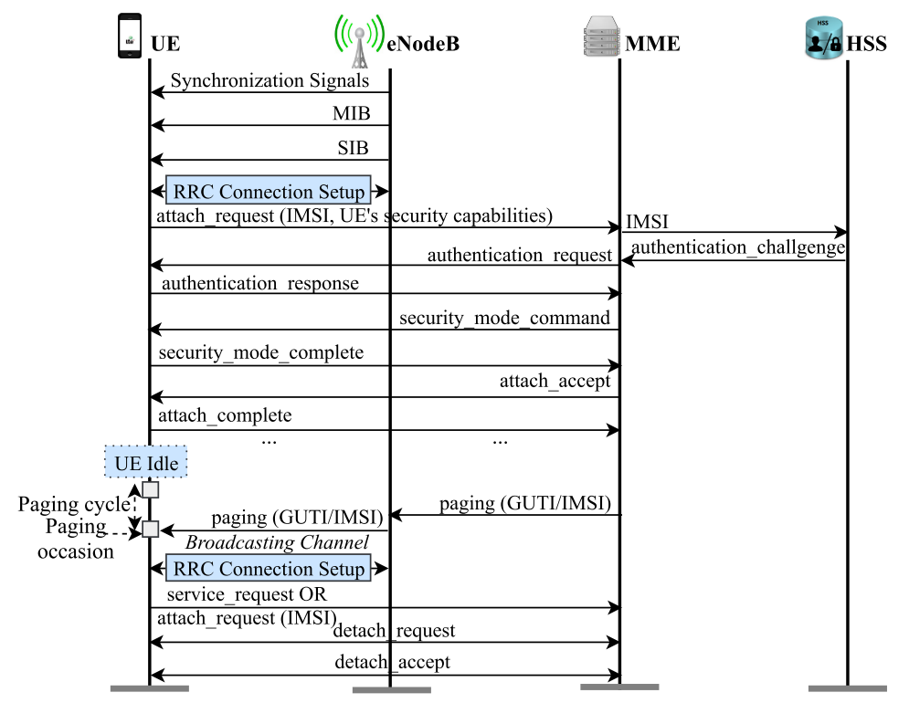

### 3.1.1  RRC 连接建立

1. 小区同步：UE（蜂窝设备）会在允许该设备工作的频带中扫描由附近基站广播的帧同步信号，并且对于每个频率，它只会识别在所有合适/可接受的小区中最强的信号。当找到可接受的小区时，UE 会驻扎在该小区上，并且在需要的时候发起小区重选过程。
2. UE 捕获（读取）所选小区（基站）发送的 MIB 消息，并进行时间同步。在 MIB 消息中包含了网络当前的 SFN（系统帧号）以及连接相关参数，用于 UE 与基站达成同步并连接到基站。
3. UE 从 SIB 消息获知连接相关参数的值，之后 UE 发起到基站（在 RRC 层）和到核心网（在 NAS 层）的连接。

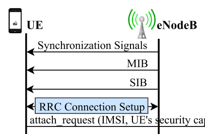

> Synchronization Signals：Primary Synchronization Signal (PSS，主同步信号) and Secondary Synchronization Signal (SSS，辅助同步信号) are two specific physical layer signals that are used for radio frame synchronization and physical cell identification.
>
> Master Information Block (MIB，主信息块)：A base station periodically (every 40 ms)
> broadcasts master info block messages to advertise the existence of the network irre-spective of any user’s presence in a cell area. Therefore, the very first step for a UE to gain initial access to the network is to read the master info block (MIB) message that includes the downlink channel bandwidth, configuration parameters for decoding sub-sequent messages, and the current system frame number (SFN) for UE’s time/frame synchronization with the network.（用于实现 UE 与网络的时间同步和帧同步）
>
> System Information Block (SIB，系统信息块)：A base station also periodically (every 80 ms) broadcasts system info block type 1 message that includes information regarding whether a UE is allowed to access the cell. It also defines the scheduling of the other system info block messages (e.g., system info block type 2), and carries cell ID, mobile country code (MCC), mobile network code (MNC), tracking area code (a tracking area consists of multiple cells), mapping information for other system info block messages.（用于决定是否允许 UE 接入该小区）
>
> 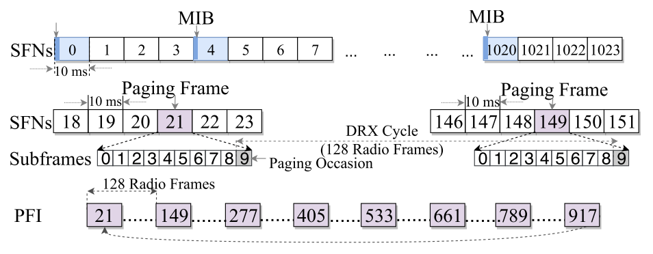
>
> Network Time/Frame Synchronization in LTE：LTE supports full duplex radio communication between a UE and a base station through frequency division duplex (FDD) mode in which the transmitter and receiver operate on different carrier frequencies. In LTE-FDD, communications are carried out through radio frames (also called system frames or type-1 LTE frames) each of which spans 10 milliseconds.They are indexed with a 10-bit circular counter (resetting to 0 after counting up to 1023), and thus have System Frame Numbers (SFN) in the range of [0, 1023]. Thus for every 10.24 seconds, SFN will repeat. Each frame is further partitioned into 10 sub-frames each of which spans 1 millisecond.（无线帧/系统帧：10 ms、子帧：1 ms）

小区同步：指终端同步到服务小区。首先，终端与服务小区进行物理层的同步（时间、频率）；然后，终端经过测量和判决过程后，驻留到服务小区，接收服务小区广播的系统信息（SIB），实现信息同步。

> FDD LTE 空中接口的时间结构：
>
> - 无线帧：10 ms
> - 子帧：1 ms
> - 时隙：0.5 ms
> - OFDM 符号：66.7 μs

### 3.1.2  身份识别

1. UE 通过基站向 EPC 发送 `attach_request` 消息来启动附着流程，该消息中携带了 UE 的 ID（IMSI/IMEI）及其安全能力（支持的加密和完整性保护算法）。
2. MME 在 nas 层数据中获取到 UE 的 IMSI，并为该 UE 创建对应的 `nas_ctx`（包含：`emm_ctx`、`ecm_ctx`、`esm_ctx`、`sec_ctx`）。
   - `emm_ctx`：IMSI、emm state（未注册/注册/...）。
   - `ecm_ctx`：ul/dl nas_count、enb_sri（基站信息）、E-RABs。
   - ……

### 3.1.3  鉴权

1. 当 MME 处理完来自 `attach_request` 的 nas 层数据后，会向 HSS 获取该 UE 的鉴权向量（`gen_auth_vectors_from_hss()`），并为 `auth_vectors` 分配 `eksi = 0`。然后，MME 会保存该 UE 的 context（上下文）。最后，MME 向 UE 发送一条 `auth_request` 消息。
2. UE：
   - 若鉴权成功，则 UE 向 MME 回复一条 `auth_response` 消息。
   - 若鉴权失败，则 UE 向 MME 回复一条 `auth_failure` 消息，其中携带了 UE 当前的 sqn 值，用于 HSS 再次同步该 UE 的 sqn 值。
3. MME：
   - 若鉴权成功，则 MME 向 UE 回复一条 `auth_accept` 消息。
   - 若鉴权失败，则 MME 向 UE 回复一条 `auth_reject` 消息。

> 鉴权过程需要用到的两个关键参数（存储在 USIM 卡和 HSS 中）：
>
> - 用户标识：IMSI（International Mobile Subscriber Identification Number），15 位，采用 BCD 码的格式。
> - 用户秘钥：K 参数，128 比特，二进制数。
>
> 在鉴权时，由 MME 发起请求，HSS 根据 MME 提供的终端 ID（IMSI），利用随机数（RAND）和用户秘钥（K）等参数，通过鉴权算法（EPS AKA Algorithm）生成一个鉴权向量，又称为 4 元组，发给 MME。
>
> 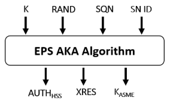
>
> 其中，Sequence Number（SQN）与当前 UE 的状态同步。
>
> 鉴权向量（4 元组）中包含：
>
> - RAND（Random Number）：随机数。
> - AUTN（Authentication Token）：鉴权令牌。
> - XRES（Expected Response）：利用鉴权算法得到的标准鉴权结果。
> - K<sub>ASME</sub>（Intermediate Key）： 中间秘钥，用来产生用于加密和完整性保护的一整套秘钥（ASME：接入安全管理实体）。
>
> MME 通过 eNB 将鉴权向量中的 RAND、AUTN 下发给终端。
>
> 终端收到后，首先利用 AUTN 实现对网络的鉴权，成功后根据 RAND、用户秘钥（K）等参数，利用鉴权算法，得到鉴权结果 RES，终端再把 RES 发给 MME。
>
> MME 通过对比 HSS 下发的 XRES 和终端上报的 RES 是否相等，可以判断鉴权是否成功，从而确定用户的身份。

### 3.1.4  安全算法协商

……

### 3.1.5  安全临时 id 交换

……

## 3.2  寻呼流程

### 3.2.1  基本概念

终端的待机状态：

- 待机状态（IDLE）：UE 与 EPC 一旦建立了所有的 NAS 与 RRC 连接，UE 将进入空闲状态并停用其自身和 eNB 之间的无线电链路（RRC）。
- DRX（Discontinuous Receive，不连续接收）：终端在待机状态下分为休眠和唤醒两种状态，终端平时休眠，短时唤醒，计时以无线帧（10 ms）为单位。当 UE 不再活跃地与基站进行通信时，会进入 IDLE（待机）模式，即低功耗模式，可以节省电池的电量。基站可以通过寻呼唤醒 UE，通知其一些紧急信息，或者网络服务（如：有来电、短信等）。终端唤醒的时刻是固定的，与 SFN（系统帧编号）有关，唤醒时刻所在的无线帧的 SFN 与终端的 IMSI 有关，这样就可以分散终端的唤醒时刻，减轻基站的负荷（无线帧的编号一共只有 1024 个，因此终端唤醒的时刻由 `ue_index = imsi % 1024` 计算）。
- 终端在待机状态时的任务：
  - 找准自己所处的小区，进而找到自己应该归属的基站。
  - 监听小区广播（系统信息）和寻呼消息。
- 如果 EPC 需要向空闲状态的 UE 发送消息，则 eNB 的任务是唤醒空闲设备并重新建立物理连接。这是通过向 eNB 的操作区域中的 ue 发送寻呼消息来实现的。

位置区：

- 一个位置区由相邻的几个小区组成，并且通常不跨基站，即一个基站的三个小区最好属于同一个位置区。
- 位置登记（位置更新）：终端向核心网汇报自己所在的位置（在哪个基站的覆盖范围下），从而可以实现被叫的机制。设置了位置区后，终端只有改变了位置区，才会向基站汇报，进行位置更新。这样一来，网络侧掌握的终端位置从小区变成了位置区，不够精确，需要寻呼机制来解决这个问题。
- 寻呼区：考虑到用户会不断地移动，移动通信网络往往会在几个相邻基站的覆盖范围内同时寻呼终端，这个区域叫做寻呼区。位置区一般与寻呼范围保持一致，终端在位置区内移动不需要进行位置的更新。
- 在 LTE 系统中，位置区叫做 TA（Tracking Area，跟踪区），还引入了 TA 列表，它是 1 - 16 个相邻 TA 的组合，一个 TA 可以属于多个 TA 列表。在 LTE 系统中，终端如果只是在 TA 列表的范围内移动，即使改变了 TA，也不用进行位置更新。TA 列表与用户相关，不同的用户可以设置不同的 TA 列表，即差异化的位置更新。
- 终端如何获得 TA 列表？在终端进行位置更新时，会向核心网上报自己所在的 TA，然后核心网会下发终端的 TA 列表信息，终端就知道自己的 TA 列表了。另外，核心网还会下发 S-TMSI（SAE-Temporary Mobile Subscriber Identity，SAE 移动用户临时标识），作为终端的标识，将用于寻呼过程。

> TA（Tracking Area，跟踪区）：这是 LTE 系统引入的新术语，类似于 WCDMA 和 GPRS 系统的路由区（RA），每个 eNB 都属于一个 TA。LTE 系统为每个终端定义了归属 TA，这些 TA（最多 16 个）构成了 TA 列表。当终端离开所属 TA 列表时，就要进行 TA 更新。

寻呼：

- 从 MME 的角度看，不管终端处于待机状态还是联机状态，都可以呼叫终端。从无线网络的角度看，呼叫待机状态的终端才称为寻呼，呼叫联机状态的终端被称为通知。
- 移动通信网络利用数据库记录终端的位置，该数据库被称为位置寄存器。移动通信网络收到被叫的请求后，首先查找位置寄存器，确定终端当前所处的位置，再将被叫的请求发到相关基站，由基站寻呼终端。
- MME 会在寻呼区的范围内进行寻呼，寻呼区就等于终端 TA 列表中的所有基站，MME 将被寻呼终端的信息推送给 TA 列表中的基站。

寻呼流程：

1. SGW 是数据业务的锚点，与终端相关的数据包根据终端的 IP 地址来路由，最终会到达 SGW。SGW 收到终端相关的数据包后，需要 MME 通过寻呼来通知终端有数据到达。
2. 当网络侧有终端的数据到达时，如果终端处于待机状态，那么 MME 就会根据终端的上下文，找到终端的 TA 列表（`TAI List`），生成寻呼消息。
3. MME 在 SI-MME 接口上推送寻呼消息，其中携带着终端的 TA 列表、S-TMSI 等参数。
4. eNB 收到寻呼消息后，会根据消息中 TA 列表的参数以及自身所处的 TA，判断是否要广播寻呼消息。
5. 终端在寻呼帧时刻被唤醒，若发现寻呼消息中包含的是自己的 IMSI，就会进行随机接入的过程。

寻呼间隔：

- 寻呼帧：是承载有寻呼消息的无线帧，寻呼帧的周期就是 DRX 周期（常见的是 32 个无线帧，即 320 ms）。DRX 周期中寻呼帧的比例越小，寻呼的开销就越小，但是需要避免寻呼能力不足带来的寻呼拥塞，寻呼拥塞会增加呼叫的延时，影响用户的感知。
- 寻呼时机（Paging Occasion）：是寻呼帧中承载有寻呼消息的子帧。
- 在一个寻呼帧的周期（DRX 周期）中，有多个无线帧和子帧可以用来发送寻呼消息，那么具体到特定的终端，对应的寻呼消息应该在哪里发送呢？这个位置与终端的 UE_ID 参数相关，等于终端的 IMSI 对 1024 取模的结果，由 MME 在寻呼消息中推送给基站，基站再根据终端的 UE_ID 计算出寻呼帧和寻呼时机，然后在特定的寻呼时机上发送寻呼消息。
- 寻呼协议确保当基站在给定时间发送 UE 的寻呼记录时，UE 也会在该时间醒来检查。也就是说，基站和 UE 必须就何时发送/接收 UE 的寻呼记录达成一致。如果存在寻呼消息，则 UE 会遍历其中的寻呼记录来搜索自己的寻呼 ID（IMSI 或 TMSI）。若 UE 在寻呼消息中找到了自己的 ID，则会重新与基站建立连接。

> 《LTE教程：机制与流程》（P43）：
>
> 寻呼消息定位参数：
>
> - SIB2 广播
>   - 寻呼相关的配置参数（nB）
>     - 寻呼帧密度（N）
>     - 寻呼时机密度（Ns）
>   - 默认 DRX 周期（defaultPagingCycle）
> - IMSI -> UE_ID
>
> 根据寻呼消息定位参数，利用散列的方法，可以确定唤醒时刻（唤醒时无线帧的 SFN）。
>
> 终端再根据双工方式、UE_ID、Ns，可以确定寻呼时机，做好了在这个子帧上接收消息的准备。

寻呼消息：

- 寻呼消息使用特定的寻呼 RNTI（P-RNTI）来指示寻呼的广播性质，如果正在寻呼某个 UE 的 IMSI 或系统架构演进（SAE）临时移动用户身份（S-TMSI），则该 UE 需要做出响应。
- MME 采用 S-TMSI 作为终端的 ID 来寻呼终端，S-TMSI 是 LTE 终端在 MME 中的临时标识，由移动性管理实体代码（MME code）和移动 TMSI（m-TMSI）的组合。如果终端没有被分配到 S-TMSI，MME 就会用终端的 IMSI 来寻呼终端，这样不太安全。
- 基站采用间歇发射的方式，每个终端的寻呼消息只在预定义的时刻发送，对应终端的唤醒时刻，由终端的 DRX（不连续接收）周期来决定。寻呼消息发送的时机与终端的 UE_ID 相关，UE_ID 等于终端的 IMSI 对 1024 取模的结果（`ue_index = imsi % 1024`），由 MME 在寻呼消息中推送给基站。
- 每一条寻呼消息会包含 1 - 16 条寻呼记录。每条寻呼记录都会通知一个 UE 有它到来的服务。
- 在 LTE 系统中，寻呼消息由 PDSCH 来承载，与业务数据和其它信令一起分享 PDSCH。这样的记录包含 MME 标识符、域（PS 或 CS）和目标 UE 的寻呼标识，其可以是由 MME 确定的 IMSI 或 TMSI。

> GUTI = MME identifier + TMSI (Temporary Mobile Subscriber Identity)
>
> The MME/eNodeB uses few bytes of GUTI as TMSI to represent the temporary identifier.

业务寻呼：

- 场景：有与 UE 相关的业务到达网络。
- smart paging：如果使用该功能，MME 首先会让 UE 最近连接过的基站去向 UE 广播寻呼消息；如果没有收到来自 UE 的回应，则会通知所有基站在它们的 tracking area 中广播寻呼消息。
- non-smart paging：会直接通知所有基站进行寻呼。如果仍然没有来自 UE 的回应，则会假定 UE 已经离开了当前的 tracking area，或者并没有与网络进行通信。

### 3.2.2  MME 从 S11 接口接收下行数据通知

> - 代码位置：srsepc/src/mme/mme_gtpc.cc
> - 函数接口：mme_gtpc::handle_downlink_data_notification(...)
> - 传输方向：GTP-C -> MME

1. MME 从 S11 接口接收到 GTP-C PDU。
2. 从 `dl_not_pdu` 中获取 `mme_ctrl_teid` 和 `downlink_data_notification`。
3. 根据 `mme_ctrl_teid` 获取 `IMSI`。
4. 从 `downlink_data_notification` 获取 `eps_bearer_id`（`ebi`）。
5. 向 s1ap 接口发送寻呼消息：`m_s1ap->send_paging(imsi_it->second, ebi)`。

### 3.2.3  MME 向 S1AP 接口发送寻呼消息

> - 代码位置：srsepc/src/mme/s1ap_paging.cc
> - 函数接口：s1ap_paging::send_paging()
> - 传输方向：MME -> S1AP

1. 准备 PDU。
2. 获取 UE NAS Context。
3. 计算 UE Identity Index：`ue_index = imsi % 1024`（`paging.ue_id_idx_value`）。
4. 设置 UE Paging Id（`paging.ue_paging_id` 指 `s_tmsi`），包括：
   - `m_s1ap->m_s1ap_args.mme_code`
   - `nas_ctx->m_sec_ctx.guti.m_tmsi`
5. 设置 `CMDomain` 和 `TAI List`。
6. 开启 T3413 定时器：`nas_ctx->start_timer(T_3413)`。
7. 向所有 active 的基站发送 PDU：`m_s1ap->s1ap_tx_pdu(tx_pdu, &enb_ctx->sri)`。
8. 使用 `sctp_send()` 向基站发送 S1AP PDU。

### 3.2.4  基站处理 S1AP PDU

> - 代码位置：srsenb/src/stack/s1ap/s1ap.cc
>
> - 传输方向：MME -> eNB

1. s1ap::handle_mme_rx_msg(...)：接收来自 MME 的 `pdu`，并判断是否出错 。
2. s1ap::handle_s1ap_rx_pdu(...)：解析 `pdu` 为 `rx_pdu`，并根据 `rx_pdu.type().value` 进行不同的处理。
3. s1ap::handle_initiatingmessage(...)：处理 `rx_pdu.init_msg()`，并根据 `msg.value.type().value` 进行不同的处理。
4. s1ap::handle_paging(...)：处理 `msg.value.paging()`，获取 `ue_id_idx_value` 和 `ue_paging_id` 并传递给 RRC 层。

```c++
bool s1ap::handle_paging(const asn1::s1ap::paging_s& msg)
{
  WarnUnsupportFeature(msg.ext, "S1AP message extension");

  uint32_t ueid = msg.protocol_ies.ue_id_idx_value.value.to_number();
  rrc->add_paging_id(ueid, msg.protocol_ies.ue_paging_id.value);
  return true;
}
```

### 3.2.5  基站添加寻呼记录

> - 代码位置：srsenb/src/stack/rrc/rrc.cc
>
> - 传输方向：S1AP -> RRC

1. rrc::add_paging_id(...)：根据 `ue_paging_id.type().value` 选择使用 `imsi` 或 `s_tmsi` 进行寻呼。
2. 设置寻呼记录的属性：
   - paging_manager::add_imsi_paging(...)：设置 `paging_elem` 的属性（使用 `imsi` 作为 `ueid` 并设置 `cn_domain` 为 `ps`），并将其添加到寻呼记录中。
   - paging_manager::add_tmsi_paging(...)：设置 `paging_elem` 的属性（使用 `mmec` 和 `m_tmsi` 作为 `ueid` 并设置 `cn_domain` 为 `ps`），并将其添加到寻呼记录中。
3. paging_manager::add_paging_record(...)：添加寻呼记录（参考 `TS 36.304，Section 7`）。

```c++
void rrc::add_paging_id(uint32_t ueid, const asn1::s1ap::ue_paging_id_c& ue_paging_id)
{
  if (ue_paging_id.type().value == asn1::s1ap::ue_paging_id_c::types_opts::imsi) {
    pending_paging->add_imsi_paging(ueid, ue_paging_id.imsi());
  } else {
    pending_paging->add_tmsi_paging(ueid, ue_paging_id.s_tmsi().mmec[0], ue_paging_id.s_tmsi().m_tmsi);
  }
}
```

## 3.3  去附着流程

### 3.3.1  UE 发起分离请求

1. UE 向 EPC 发送 `detach_request`。

### 3.3.2  MME 处理分离请求

1. 解包 `nas_rx`，解析 `detach_request` 消息。
2. 根据 `m_tmsi` 获取 `imsi`，再根据 `imsi` 获取 `nas_ctx`。
3. 设置 `nas_ctx` 中的 `emm_ctx`（将 UE 的 EMM 状态设置为 `deregistered`）、`ecm_ctx`、`sec_ctx`。
4. 向 UE 回传 `detach_accept`。
5. 向 `gtpc` 接口发送 `delete_session_request`。
6. 向 `s1ap` 接口发送 `ue_context_release_command`，让基站释放 UE 的上下文。

## 3.4  位置更新流程

### 3.4.1  基本概念

位置更新：

- 终端主动去通知网络自己所在的位置，而不是网络费力地去发现终端的位置。在 LTE 系统中，终端的位置定位到 TA。
- 终端通常会在以下三种情况进行 TAU：
  - 终端在小区重选后，发现进入了新的 TA，而且新的 TA 又不在网络下发的 TA 列表中。
  - 终端根据一个定时参数，周期性地进行 TAU（确保网络侧能及时跟踪到终端的位置）。
  - 终端从异系统（GSM、WCDMA 等）返回。

> - TA：Tracking Area，跟踪区
> - TAU：Tracking Area Update，跟踪区更新

TAI（Tracking Area Identity，跟踪区标识）：

- 终端如何知道 TA？在基站广播的 SIB1 消息中，包含了 TA 的信息，称为 TAI。
- TAI 由 3 部分组成：
  - MCC（国家代码）：12 bit
  - MNC（移动网络代码）：8 bit
  - TAC（跟踪区）：16 bit

GUTI（Globally Unique Temporary UE Identity，终端全球唯一标识）：

- 网络如何知道终端？在 TAU 过程中，终端用到的标识比较复杂，称为 GUTI，由核心网分配。
- GUTI 由 5 部分组成：

  - MCC（国家代码）：12 bit
  - MNC（移动网络代码）：16 bit
  - MMEGI（MME 池组编号）：16 bit
  - MMEC（MME 代码）：8 bit
  - M-TMSI（MME 为终端分配的临时标识）：32 bit

> 这 5 部分信息还可以组合成其它的标识：
>
> - MMEI（MME 标识）：MMEGI + MMEC
> - GUMMEI（MME 全球唯一标识）：MCC + MNC + MMEI
> - S-TMSI（终端临时标识）：MMEC + M-TMSI
>
> S-TMSI 用于寻呼和随机接入。

### 3.4.2  小区重选

1. 终端定时测量服务小区的参考信号强度（RSRP）。
2. 终端与目标小区实现物理层同步，接收目标小区的广播信息，并驻留到该小区中。
3. 终端根据 SIB1 得到所在的 TA，如果发现需要进行位置更新，终端就会完成位置更新相关的随机接入流程。

### 3.4.3  随机接入

1. UE -> eNB：随机接入前导。
2. eNB -> UE：随机接入响应。
3. UE -> eNB：RRC Connection Request。
4. eNB -> UE：RRC Connection Setup。

### 3.4.4  位置更新

1. 请求位置更新：
   - 终端向基站发送 TAU Request 消息（由 RRC Connection Setup Complete 消息承载）。
   - 基站向 MME 转发 TAU Request 消息（由 Initial UE Message 消息承载）。
2. 鉴权（可选）：当终端的安全信息已经失效时，MME 必须对终端进行鉴权；反之，则鉴权不是必须的。
   - MME -> UE：Authentication Request（包含了关键的随机数 RAND、终端对网络鉴权所需的 AUTN 参数，这些参数来自 HSS 提供的鉴权向量）。
   - UE -> MME：Authentication Response（包含了生成的中间数 RES）。
   - MME 比较收到的 RES 和 HSS 下发的 XRES，如果相等，表明鉴权成功，用户是合法用户。
3. NAS 加密：MME 为终端指定 NAS 加密和完整性保护的算法。
4. 接受位置更新：
   - MME 根据用户在 TAU Request 消息中上报的位置信息，更新终端用户的上下文。
   - MME -> eNB：发送 TAU Accept 消息，包含为终端分配的标识 GUTI、TA 列表、定时器等信息
   - 启动接入层 AS 的安全机制。
   - eNB -> UE：转发 TAU Accept 消息。
5. 完成位置更新：UE 向 MME 回复 TAU Complete 消息。

### 3.4.5  资源释放

……

# 4  安全机制

LTE 网络中的安全机制包含如下内容：

- 鉴权
- 加密
- 完整性保护

## 4.1  鉴权

在 LTE 系统中，为了鉴别接入网络的终端设备的合法性，核心网需要对终端设备进行 Authentication（鉴权），从而确定用户的身份。用户身份可以使用在 LTE 系统中具有唯一性的用户标识来进行表示。根据用户的标识，核心网可以识别出终端设备的身份。另外，用户密码在鉴权流程中也是必要的一个参数，只有同时使用用户标识和用户密码进行验证才能防止非法用户的身份伪造等问题。当终端请求附着到核心网中时，首先需要向 LTE 网络提供自己的用户标识和用户密码。然后，MME 会将它们与 HSS 中对应的用户信息进行比较，若信息相符，则说明当前请求接入的终端设备是合法用户。

在鉴权过程中，需要用到两个关键参数：用户标识和用户密码。用户标识又可以叫做 IMSI（International Mobile Subscriber Identification Number，国际移动用户识别码），相当于用户的身份证号码。IMSI 是 LTE 网络中的一个重要标识符，唯一地归属于其特定的 USIM 卡。IMSI 是一个 15 位的数字，其中前三位标识终端用户归属的国家（MCC，移动国家码），随后的两个或三个数字标识终端用户归属的网络（MNC，移动网络代码），剩余的数字标识网络运营商的数据库内特定的用户。每个用户的 IMSI 都存储在终端设备的 USIM 卡和核心网的 HSS 中。用户密码又可以叫做秘钥或者 K 参数，是一个长度为 128 比特的数字。每个用户的秘钥也都同时存储在终端设备的 USIM 卡和核心网的 HSS 中。

在 LTE 系统中，当核心网对终端进行鉴权时，终端也可以对网络进行鉴权，即采用了双向鉴权的机制。该机制可以有效克制 GSM 系统中泛滥的伪基站问题。

LTE 网络的鉴权流程如下图所示：

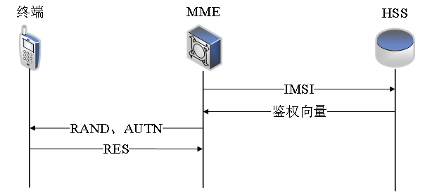

当终端向 MME 发起附着请求后，下一步就会进入鉴权流程。首先，MME 会向 HSS 请求获取鉴权向量。然后，HSS 会根据 MME 提供的终端设备的 IMSI 来查找该终端设备对应的用户秘钥 K，再结合 RAND（随机数）以及 SQN（Sequence Number），通过 EPS AKA Algorithm（鉴权算法）生成一个鉴权向量（又称为四元组）并发送给 MME。其中，HSS 中的 SQN 值需要与当前 UE 中的 SQN 值保持同步。

LTE 网络中的鉴权方法如下图所示：

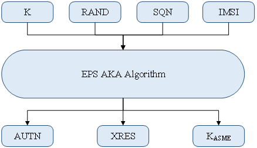

HSS 生成的鉴权向量中包含如下内容：

- RAND（Random Number，随机数）：长度为 128 比特。
- AUTN（Authentication Token，鉴权令牌）：长度为 128 比特。
- XRES（Expected Response，期望鉴权结果）：长度为 64 比特，是利用鉴权算法得到的标准鉴权结果。
- K<sub>ASME</sub>（K<sub>ASME</sub>，接入安全管理实体）：是一个中间秘钥，用于产生加密和完整性保护的一整套秘钥。

当鉴权向量生成之后，MME 会通过 eNB 将其中的 RAND 和 AUTN 发送给 UE 进行鉴权，UE 收到后首先会利用 AUTN 实现对网络的鉴权，成功后 UE 会根据 RAND、K 以及 UE 当前的 SQN，利用鉴权算法计算得到 RES（鉴权结果）并把该结果回复给 MME。最后，MME 通过对比 HSS 下发的 XRES 和终端上报的 RES 是否相等，从而确定用户的身份，完成对网络对用户的鉴权。

## 4.2  加密

LTE 系统在空中接口上使用开放的无线电波进行信息传输，为了防止传输的消息被恶意用户窃听和截取，需要对传输的数据进行加密处理，比如鉴权时使用到的用户密码就需要经过加密后才进行传递。另外，为了提高系统的安全性，用户密码在每一次鉴权过程中都会根据算法发生变化，这样即使该密码被获取，恶意用户截获到的也只是一次性的数据。

用户密码对应的数据使用参数加密的方法产生，需要用到随机数据、秘钥以及加密算法等参数：

- 随机数据：由LTE网络提供，是一次性的数据。
- 秘钥：即用户密码，是加密算法的入参。
- 加密算法：由LTE网络提供，是全网统一的，不对外公开。

用户秘钥的加密方法如下图所示：

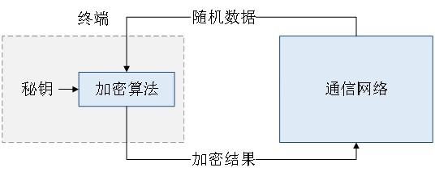

LTE 网络的 HSS 中存储有每个用户的秘钥，HSS 可以根据统一的加密算法和 LTE 网络提供的随机数据计算出用户秘钥对应的标准加密结果。如果从用户那里得到的加密结果与标准的加密结果一致，那么就说明该用户是合法的用户，反之，则该用户是非法用户。因此，外界即使有人进行窃听，也只能获得随机数据和加密结果，而不知道对应的加密算法和密钥。由于随机数据是不断变化的，对应产生的加密结果也是会随之不断变化的，因此LTE网络中用户密码的传递具有很强的保密性。

## 4.3  完整性保护

完整性保护的目的是为了防止非法用户恶意篡改信息的内容，在 LTE 网络中用于信令的处理。完整性保护类似于压缩文件后的 CRC 校验，是在原始信息后附加一段内容，附加内容的生成依赖于特定的完整性保护算法。完整性保护算法需要用到原始数据、完整性保护秘钥以及计数器值等参数。接收方可以利用原始数据、已知的完整性保护秘钥、计数器值等参数，使用同样的完整性保护算法计算出当前数据的附加内容。若接收方计算得到的附加内容与接收数据的附加内容不一致，说明要么是原始数据已经受到了恶意的篡改，要么是完整性保护的参数出错，此时接收到的数据将会被接收方丢弃。若接收方计算得到的附加内容与接收数据的附加内容一致，则说明接收到的数据时完整的，接收方将接收该数据。

# 5  UE 上下文

## 5.1  基本概念

UE 上下文（Context）可以理解为终端用户的档案，是终端用户相关信息的集合。

- 静态信息：终端 ID、用户电话号码、签约信息、服务等级、安全信息等。
- 动态信息：终端临时 ID、所在位置、用户的业务连接等。

> 在 LTE 系统中，终端用户的静态信息存储在 HSS 和 MME 中。

## 5.2  上下文内容

当 UE 首次 attach 到 MME 中时，MME 会在 NAS 层为其创建 `nas_ctx`，其中包含了 4 种类型的上下文。

```c++
class nas
{
public:
  ...  
  
  /* UE Context */
  emm_ctx_t m_emm_ctx                   = {};
  ecm_ctx_t m_ecm_ctx                   = {};
  esm_ctx_t m_esm_ctx[MAX_ERABS_PER_UE] = {};
  sec_ctx_t m_sec_ctx                   = {};
    
  ...
};
```

4 种不同类型上下文的定义如下：

```c++
// emm_ctx
typedef struct {
  uint64_t               imsi;
  emm_state_t            state;
  uint8_t                procedure_transaction_id;
  uint8_t                attach_type;
  struct in_addr         ue_ip;
  srsran::gtpc_f_teid_ie sgw_ctrl_fteid;
} emm_ctx_t;

// ecm_ctx
typedef struct {
  ecm_state_t            state;
  uint32_t               enb_ue_s1ap_id;
  uint32_t               mme_ue_s1ap_id;
  struct sctp_sndrcvinfo enb_sri;
  bool                   eit;
} ecm_ctx_t;

// esm_ctx
typedef struct {
  uint8_t                                erab_id;
  esm_state_t                            state;
  uint8_t                                qci;
  srsran::gtpc_f_teid_ie                 enb_fteid;
  srsran::gtpc_f_teid_ie                 sgw_s1u_fteid;
  srsran::gtpc_pdn_address_allocation_ie pdn_addr_alloc;
} esm_ctx_t;

// sec_ctx
typedef struct {
  uint8_t                                 eksi;
  uint8_t                                 k_asme[32];
  uint8_t                                 autn[16];
  uint8_t                                 rand[16];
  uint8_t                                 xres[16]; // minimum 6, maximum 16
  uint32_t                                dl_nas_count;
  uint32_t                                ul_nas_count;
  srsran::CIPHERING_ALGORITHM_ID_ENUM     cipher_algo;
  srsran::INTEGRITY_ALGORITHM_ID_ENUM     integ_algo;
  uint8_t                                 k_nas_enc[32];
  uint8_t                                 k_nas_int[32];
  uint8_t                                 k_enb[32];
  LIBLTE_MME_UE_NETWORK_CAPABILITY_STRUCT ue_network_cap;
  bool                                    ms_network_cap_present;
  LIBLTE_MME_MS_NETWORK_CAPABILITY_STRUCT ms_network_cap;
  LIBLTE_MME_EPS_MOBILE_ID_GUTI_STRUCT    guti;
} sec_ctx_t;
```

> 以上代码为 srsRAN 对 UE Context 的具体实现。

# 6  代码参考

## 6.1  Detach Type

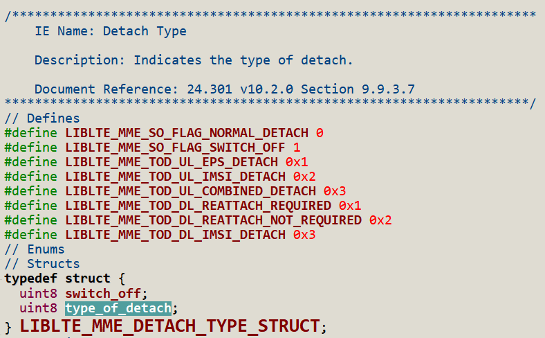

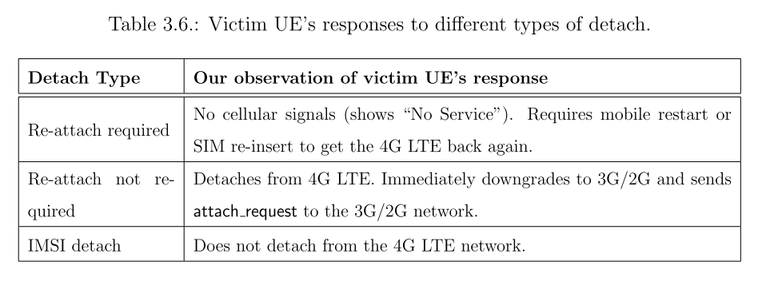

## 6.2  EMM Cause

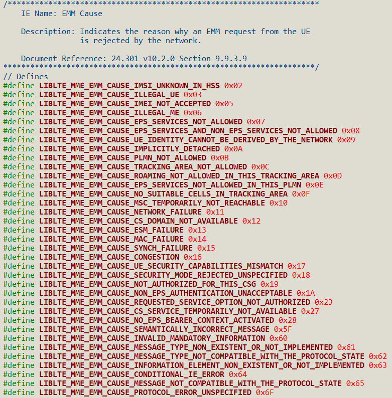

## 6.3  NAS Message Header Type

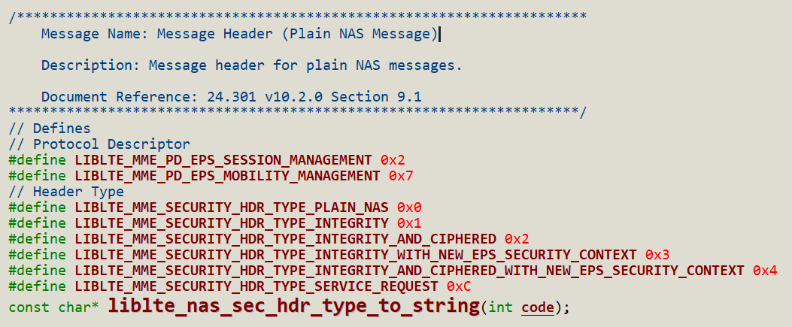

## 6.4  Timers

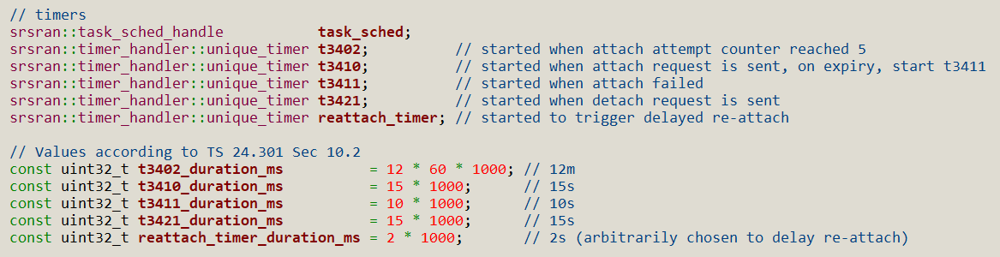