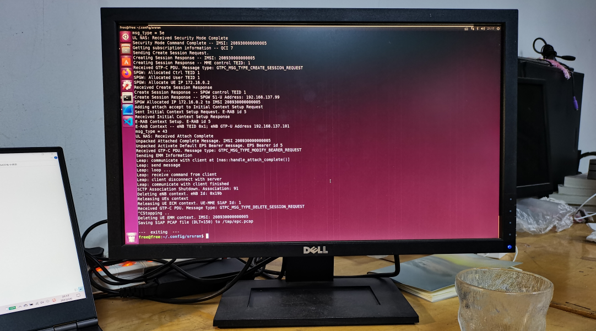
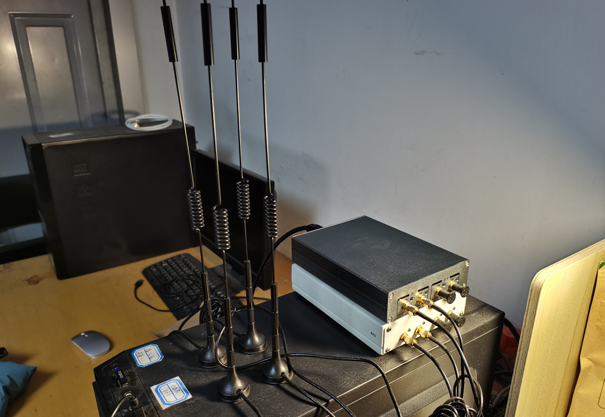

# 环境搭建教程

本项目基于开源 LTE 协议栈 srsRAN 进行开发，分为服务端和客户端两个部分，本教程将对本项目的环境搭建流程以及运行方法进行介绍。

包含的内容如下：

- srsRAN 环境搭建教程
- LSCAP 服务端配置
- LSCAP 客户端配置
- 硬件设备
- 运行项目

## srsRAN 环境搭建教程

### 安装 Ubuntu 系统

> 运行本项目需要安装 Ubuntu 16.04 LTS 最新版的实体机环境。

系统设置走一圈（隐私，显示，更新），打开终端（禁用回滚行数限制，设置透明）。

连接网络，“设置-软件和更新-下载自”选择其他站点，选择 `mirrors.tuna.tsinghua.edu.cn`，点击选择服务器。

更新软件：

```shell
sudo apt-get update
sudo apt update
```

将目录路径更改为中文：

1. `export LANG=en_US`
2. `xdg-user-dirs-gtk-update`
3. 选择 `update names`（不勾选下次不要询问我）
4. `export LANG=zh_CN`
5. 重启
6. 勾选不要再次询问我，选择保留旧的名称

更换低延迟内核（防止信号处理超时）：

```shell
sudo apt-get update
sudo apt update
sudo apt-get install linux-image-lowlatency linux-headers-lowlatency
sudo update-grub
# 重启
```

开机选择进入 Ubuntu 高级选项中的低延迟内核（不是 `upstart`，不是 `recovery mode`，而是 `lowlatency` 的第一个）。

验证内核：

```shell
uname -a
# 或者：uname -r
```

清除多余内核：

```shell
# 1.查看内核
dpkg --get-selections | grep linux

# 2.清除内核
# 其中对于 generic 而言，一般有 5 个，都需要清除，看列表中与通用内核版本号一致的一并清除就行（这里是把名字中带 4.15.0-112 的都清除掉，名字可以叠加到一条命令中，中间用空格隔开）
sudo apt-get purge xxx

# 3.更新 grub 文件
sudo update-grub
# 发现又安装了 4.15.0-142 的通用内核，所以需要重复以上 2 个步骤，将 4.15.0-142 的内核清除，最后查看内核中没有通用内核即可

# 4.最后再次更新 grub 文件
sudo update-grub
```

修改 Ubuntu 的 grub 引导的启动顺序（默认启动项）：

1. 查看 `/boot/grub/grub.cfg` 中低延迟内核的序号，选中 `menuentry`，使用 `ctrl+f` 进行搜索，注意 `menu` 和 `submenu` 的区别，在外层标号从 0 开始往后加 1，`menu` 若是 x，则其后面的 `submenu` 是 x+1，`submenu` 内部的标号又从 0 开始往后加 1，内外层独立
2. 在 `/etc/default/grub` 中修改（修改之前使用 `sudo cp grub grub.bak` 保存一个备份）
3. 将 `GRUB_DEFAULT=0` 修改为 `GRUB_DEFAULT="1> 0"`，这是根据上面查看的序号决定的，该低延迟内核位于外层列表第 2 个位置中内层子列表的第 1 个位置，因为内外层标号均从 0 开始，所以为 `1> 0`，注意 `>` 和 `0` 之间有一个空格
4. 更新 grub 文件：`sudo update-grub`
5. 重启并验证

安装完整语言包支持：“系统设置-语言支持-完整安装”。

软件更新器，更新全部。

重启系统，开机后选择进入外层第二个的“Ubuntu高级选项”中的低延迟内核。

> 这是为了防止更新过程中又重新安装了通用内核（一般不会再安装了），若发现又安装了通用内核，则还需要按照上述步骤进行清理和修改启动顺序，清理虽然不是必须的，但最好这样做，以避免人为操作失误使程序运行在通用内核（应该运行在低延迟内核），这样做也比较干净。

更新软件：`sudo apt update`。

配置浏览器设置。

安装软件：

- net-tools
- trash-cli
- gnutls-bin
- git
- `sudo apt-get install ubuntu-restricted-extras`（视频编解码支持）
- GParted
- wireshark
- cmake

重启系统。

### 安装 srsRAN

安装 `electron-ssr-0.2.6.AppImage`（VPN）：

1. 将该文件拷入目标实体机的 Ubuntu 系统，右键 `Properties`（属性），在 `Permissions`（权限）勾选 `Allow executing file as program`（允许作为程序执行文件）
2. 双击文件图标（或右键选择运行），点击下载 ssr 软件，下载完成后进入节点配置操作界面。（下载网址：https://www.cnblogs.com/zienzir/p/10612399.html）
3. 配置相应的节点信息，点击确定
4. 选择系统代理模式为全局代理
5. 打开“系统设置-网络-网络代理”，切换为手动，并按照软件界面（点击服务器-订阅管理-通用设置）的相应信息配置 http 代理和 https 代理（`127.0.0.1:12333`），socks 主机代理（`127.0.0.1:1080`），点击应用到整个系统。
6. 配置完成，以后每次使用时，运行 `electron-ssr-0.2.6.AppImage`，然后打开“系统设置-网络-网络代理”，切换为手动的上述配置，点击应用到整个系统。使用结束后，点击图标选择退出，然后打开“系统设置-网络-网络代理”，切换为无，点击应用到整个系统。

安装 UHD 射频前端驱动：

```shell
# 1.先关闭 electron-ssr-0.2.6.AppImage

# 2.添加仓库
sudo add-apt-repository ppa:ettusresearch/uhd

# 3.再打开 electron-ssr-0.2.6.AppImage

# 4.下载并安装
sudo apt-get update
sudo apt-get install libuhd-dev libuhd3.15.0 uhd-host
```

下载安装完成后执行 `uhd_find_devices` 或 `uhd_usrp_probe` 命令，根据提示，运行命令 `sudo /usr/lib/uhd/utils/uhd_images_downloader.py`。

安装 packages：

```shell
sudo apt-get install libpcsclite-dev pcscd pcsc-tools
sudo apt-get install libdw-dev
```

安装 srsGUI：

```shell
sudo apt-get install libboost-system-dev libboost-test-dev libboost-thread-dev libqwt-qt5-dev qtbase5-dev
git clone -b release_2_0_qt5 https://github.com/srsLTE/srsGUI.git
cd srsGUI
mkdir build
cd build
cmake ../
make
make test
sudo make install
sudo ldconfig
```

安装 srsRAN：

```shell
sudo apt-get install build-essential cmake libfftw3-dev libmbedtls-dev libboost-program-options-dev libconfig++-dev libsctp-dev
git clone -b release_21_10 https://github.com/srsRAN/srsRAN.git
cd srsRAN
mkdir build
cd build
cmake ../
make
make test
sudo make install
sudo srsran_install_configs.sh user
sudo ldconfig
```

重启系统。

## LSCAP 服务端配置

> LSCAP 的服务端集成于 srsRAN 的 EPC 中，与 srsepc 的代码一起进行编译和运行。

### 替换配置文件

1. 在终端输入 `cd ~/.config/srsran`
2. 替换其中的 `enb.conf`、`epc.conf` 以及 `user_db.csv`

> 用于替换的配置文件位于 `LSCAP\server\conf` 中。
>
> 对于 user_db.csv 文件，其中的用户信息需要根据自己的终端设备（SIM 卡）进行填写。

## LSCAP 客户端配置

> LSCAP 的客户端由一些 Python 模块组成，不需要安装，修改配置后即可直接使用。

### 安装 pysctp 库

安装 pysctp-0.6.1 库：

```shell
pip insall pysctp pysctp3
```

### 修改客户端配置

1. 将 lscap 文件夹拷贝至 `home/用户名` 下
2. 在 lscap 文件夹中的 `func.py` 文件开头导入的文件路径中，将所有的用户名修改为自己的用户名

### 编译编解码共享库

编译编解码共享库：

```shell
cd /path/to/lscap/
mkdir build
cd build
cmake ..
```

> 客户端的编解码共享库在本项目所提供的代码文件中已经编译好，可以直接进行使用。

## 硬件设备

### EPC & eNB

本项目的 EPC 和 eNB 使用基于 Ubuntu 16.04.7 LTS 操作系统的个人计算机进行部署和运行。

其中，运行 eNB 的计算机需要使用低延迟内核（保证无线信号的处理时延满足要求）。

```shell
# 低延迟内核
Linux free 4.4.0-210-lowlatency #242-Ubuntu SMP PREEMPT Fri Apr 16 10:44:25 UTC 2021 x86_64 x86_64 x86_64 GNU/Linux
```

EPC 实物图：



eNB 实物图：


EPC 与 eNB 之间使用网线进行连接。

> EPC 与 eNB 之间采用 sctp 协议建立 socket 连接。

### USRP

eNB 使用 USRP B210 作为射频外设。

USRP B210 实物图：



### UE

本项目使用 `HUAWEI MLA-AL 10` 作为测试的终端设备。

UE 实物图：


## 运行项目

### 运行 EPC

> 为了更好地观察并分析实验效果，需要在实验开始之前在 EPC 上运行 Wireshark 软件。

```shell
cd ~/.config/srsran
sudo srsepc epc.conf
```

### 运行客户端

```shell
./ client
```

### 运行 eNB

```shell
cd ~/.config/srsran
sudo srsenb enb.conf
```

### 启动终端

打开终端的网络连接，然后终端就会向我们搭建的 LTE 网络（srsRAN）发起附着请求。